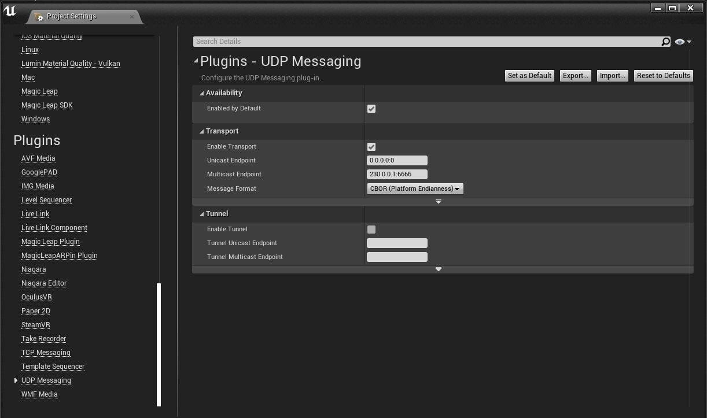

# Stereolabs ZED - Live Link Plugin
ZED LiveLink Plugin for Unreal

## ZED Live Link tool

This tool is using the Live Link plugin to connect Unreal engine 4 to the ZED SDK, which enables you to send skeleton tracking data to UE4. This way, you can control a Skeletal Mesh in real-time using the Skeleton tracking module of the ZED SDK.

It can be send through local network on Windows and Linux computers.

The object detection module can be disabled in order to send only camera tracking data.

## Getting started

 - First, download the latest version of the ZED SDK on [stereolabs.com](https://www.stereolabs.com/developers/)
- For more information, read the ZED [Documentation](https://www.stereolabs.com/docs/app-development/python/install/) and [API documentation](https://www.stereolabs.com/docs/api/python/)


To compile the tool from source, you will require a source build of Unreal Engine.

## Download the Engine

To gain access to the UE engine code, please follow the steps below:

1. Create an account at GitHub: [Sign up](https://github.com/join)
2. Create an account at Epic Games: [Sign up](https://accounts.epicgames.com/login)
3. Login to your Epic Games account and associate your GitHub account in the settings by entering your username into the GitHub account field.
5. Login to your Github account and accept the Epic team invitation* (Can take a few seconds to appear).
4. Download or clone the [UE4 engine](https://github.com/EpicGames/UnrealEngine/tree/release) code.

> The link above will result in a 404 error if your GitHub account is not linked to an Epic Game one. Make sure to follow all the instructions above.

> *If the invitation isn't sent, clicking on the following link seems to trigger it: [Unreal Group](https://github.com/orgs/EpicGames).


## Build for Windows

### Compile from Source

1. Inside the root directory, run **Setup.bat**. This will check all the project dependencies and update them as needed.
2. Clone this repository inside of <Engine Install Folder>\Engine\Source\Programs.
3. Run **GenerateProjectFiles.bat** to create project files for the engine.
4. Load the project into Visual Studio by double-clicking on the UE4.sln file, then right click on the ZEDLiveLink target and select **Build**.
5. The binaries will be placed in <Engine Install Folder>\Engine\Binaries\Win64\ZEDLiveLink\.

### Using the Live Link app

The camera input (ip, svo or serial number) can be provided directly as an argument.

To send data from a specific camera, add its serial number as arguments.
For example, to connect the camera whose serial number is 10028418, run :

```bash
$ ./ZEDLiveLink 10028418
```

3. This will open a console window and show the connection status.

## Build for Linux

### Compile from Source

1. Go into the folder you just downloaded/cloned and run **Setup.sh** from the terminal. This will check all the project dependencies and update them as needed.
2. Clone this repository inside of <Engine Install Folder>/Engine/Source/Programs.
3. In the Engine root directory, run **GenerateProjectFiles.sh**.
4. Run **make** to build the Engine.
5. Go to UnrealEngine/Engine/Build/BatchFiles and open a terminal.
6. Build the plugin with the command :
 ```bash
 $ ./RunUAT.sh BuildGraph -Script=Engine/Source/Programs/zed-LiveLink-plugin/BuildZEDLinux.xml -Target="Stage ZEDLiveLink Linux"
 ```
7. The binaries will be placed in <Engine Install Folder>/Engine/Binaries/Linux/ZEDLiveLink/.


### Using the Live Link app

The camera input (ip, svo or serial number) can be provided directly as an argument.

To send data from a specific camera, add its serial number as arguments.
For example, to connect the camera whose serial number is 10028418, run :

```bash
$ ./ZEDLiveLink 10028418
```

3. You can see the connection status in the terminal.

- On Windows :


- On Linux :


### Setting up a Unreal Engine Project


### Troubleshooting

Your firewall might block the data stream. If you do not see the ZED Source in the Live Link window, try to disable it.

If the ZED Source is not yet detected in UnrealEngine, enable **Enable by default** in **Edit** -> **Project Settings** -> **UDP Messaging** -> **Enable by default**




#### On Linux

If the plugin crashes at the start, try to run the ldd command onto the sl_wrapper.so library :

```bash
$ ldd sl_wrapper.so
```
It will show all the dependencies required by the .so and allow you to install anything that might be missing (for example lib-usb).
